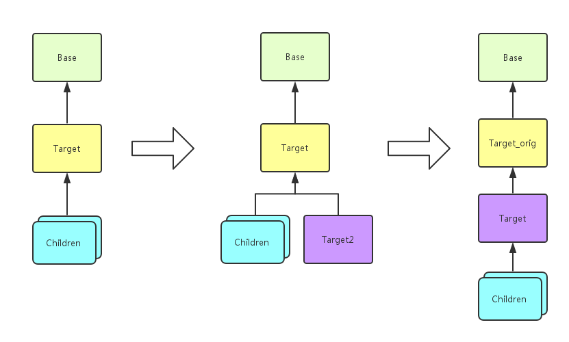

Non-invasive design with Javassist
====================================

When we imported some third-party libraries in Java, it's hard to change their source code to do some works by ourself. Non-invasive design would not work on their code but by using javassist and reflection to change the code dynamically.

If we would like to modify a class "Target" to the class "Target2" which we defined, we can use the method shown by the figure below:





First, we should inherit a class from the class to modify. Then we use the javassist library to change the superclass and the classname of our target. Then, we used the `Loader` to load a class and create objects. Because of the objects are created by other ClassLoader, we could not call its function by cast it into an interface, but we should use reflection to call it.

```java
System.out.println("Before");
new App().run();

Modifier m = new Modifier();
// Target2 must inherited from Target
m.ModifyClass("org.sxf.Target", "org.sxf.Target2"); 

System.out.println("\nAfter\n");
Class c = m.loadClass("org.sxf.App");

Object app = null;
try {
    app = c.newInstance(); // we cannot change it into App class object!
    c.getMethod("run").invoke(app); // use reflection to call it

} catch (InstantiationException | IllegalAccessException
        | NoSuchMethodException | InvocationTargetException e) {
    e.printStackTrace();
}

```
